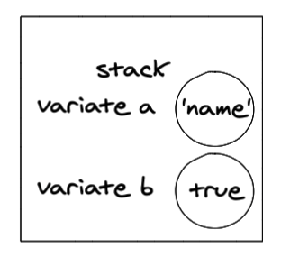
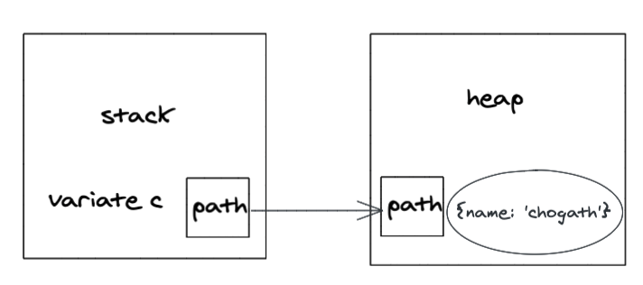
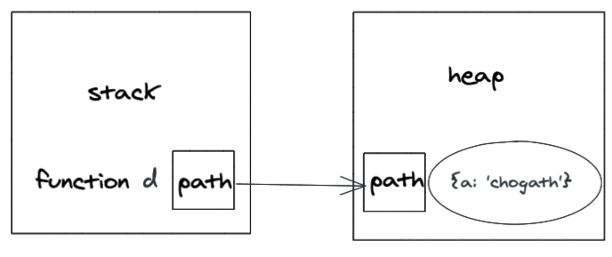
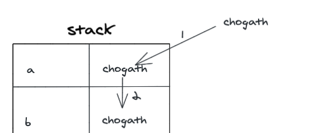
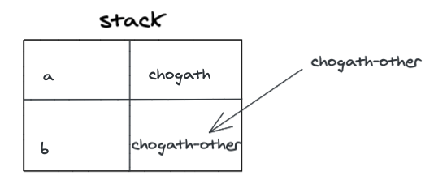
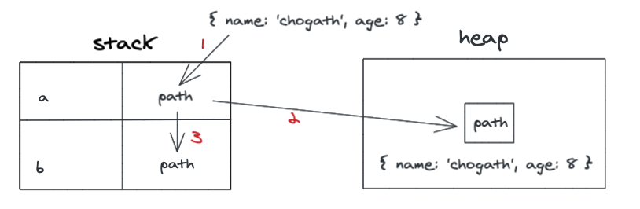
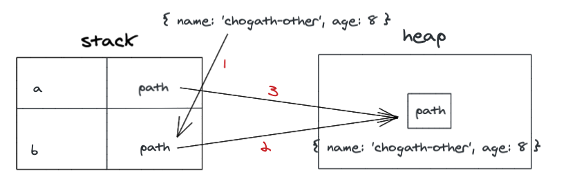

# JavaScript 中的赋值和内存分配

## 赋值

### 基本类型

> 基本类型值: undefined, null, Boolean, String, Number, Symbol 赋值后，在内存中占据固定大小，保存在栈内存中（不包含闭包中的变量）



### 对象/引用类型

> 对象/引用类型保存在堆内存中。而栈内存存储的是对象的变量标识符,以及对象在堆内存中的存储地址(引用)，引用数据类型在栈中存储了指针，该指针指向堆中该实体的起始地址。当解释器寻找引用值时，会首先检索其在栈中的地址，取得地址后从堆中获得实体。



### 闭包内的变量

> 闭包中的变量并不保存在栈内存中，而是保存在堆内存中。

```javascript
function d() {
  var a = 'chogath';

  return function() {
    console.log(a);
  }
}
```

伴随着闭包 d 的调用，为了保证变量 a 不被销毁，**javascript** 引擎会在检索闭包局部作用域后生成一个内部对象，将 a 作为内存对象的属性来存储。



## 复制（拷贝）

### 基础类型

> 在栈内存中的变量发生拷贝行为时，**javascript** 引擎会自动为新的变量分配一个独立的栈内存空间，栈空间内存储的是具体的值，两个变量相互独立，互不影响。

```javascript
var a ='chogath';
var b = a;
```



```javascript
b = 'chogath-other'；
console.log(a); // chogath
```



### 对象/引用类型-浅拷贝

> 在栈内存中的变量发生拷贝行为时，**javascript** 引擎会自动为新的变量分配一个独立的栈内存空间，栈空间内存储的是对象在堆空间的地址指针，两个变量依赖同一个堆空间

```javascript
let a = { name: 'chogath', age: 8 };
let b = a;
```



```javascript
b.name = 'chogath-other';
console.log(a.name); // chogath-other
```



### 对象/引用类型-深拷贝

> 从堆内存中开辟一个新的区域存放新对象，新对象跟原对象不共享内存地址指针，修改新对象不会改到原对象。

#### JSON.parse(JSON.stringify(object)) 的 🌰

```javascript
let arr1 = [1, 2, { name: 'chogath' }];
let arr2 = JSON.parse(JSON.stringify(arr1));

arr2[2].name = 'new_chogath'; 

console.log(arr1);// [ 1, 2, { username: 'chogath' } ]
console.log(arr2);// [ 1, 2, { username: 'new_chogath' } ]
```

#### JSON.parse(JSON.stringify(object)) 的不足

- 拷贝的对象的值中如果有**函数**, **undefined**, **symbol**，则经过 **JSON.stringify()** 序列化后的 JSON 字符串中这个键值对会消失
- 无法拷贝不可枚举的属性，无法拷贝对象的原型链
- 拷贝**Date**引用类型会变成字符串
- 拷贝**RegExp**引用类型会变成空对象
- 对象中含有**NaN**、**Infinity** 和 **-Infinity**，则序列化的结果会变成 **null**
- 无法拷贝对象的循环引用(即 **obj[key] = obj**)

#### 只能实现对对象基础类型属性进行深拷贝的方法

- `...`（es6 扩展运算符）
- Object.prototype.create
- Array.prototype.slice
- Array.prototype.concat

> 举例

```javascript
const a = [{a: 1}, 2];
b = [...a, 3];

b[0].a = 2;
console.log(b[0].a); // 2
console.log(a[0].a); // 2

b[1] = 3;
console.log(b[1]); // 3
console.log(a[1]); // 2
```

#### 完全实现深拷贝的几种方式

> 递归循环

```javascript
function deepClone(item){
  const target = item.constructor === Array ? [] : {};
  for (let keys in item) { // 遍历目标
    if (item.hasOwnProperty(keys)){
      if (item[keys] && typeof item[keys] === 'object') {
        target[keys] = item[keys].constructor === Array ? [] : {};
        target[keys] = deepClone(item[keys]);
      } else {
        target[keys] = item[keys];
      }
    }
  }
  return target;
}

const obj1 = { a:'a', b:'b' };
const obj2 = deepClone(obj1);

obj2.a = 'aa';

console.log(obj1); // { a:'a',b:'b' };
console.log(obj2); // { a:'aa',b:'b' };

const obj3 = {
  name:'chogath',
  fn: function() {
    console.log('Hello World');
  }
}
console.log(obj3); // { name: "chogath", fn: ƒ }
const obj4 = deepClone(obj3);
console.log(obj4); // { name: "chogath", fn: ƒ }
```

> es6 Array.from **(推荐)**

```javascript
var arr1 = [1,2,3];
var arr2 = Array.from(arr1);
arr1.push(4);
console.log(arr1);  //[1,2,3,4]
console.log(arr2);  //[1,2,3,]
arr2.push(5);
console.log(arr1);  //[1,2,3,4]
console.log(arr2);  //[1,2,3,5]
```

> lodash.cloneDeep **(推荐)**

```javascript
var _ = require('lodash');
var obj1 = {
    a: 1,
    b: { f: { g: 1 } },
    c: [1, 2, 3]
};
var obj2 = _.cloneDeep(obj1);
console.log(obj1.b.f === obj2.b.f);
```
