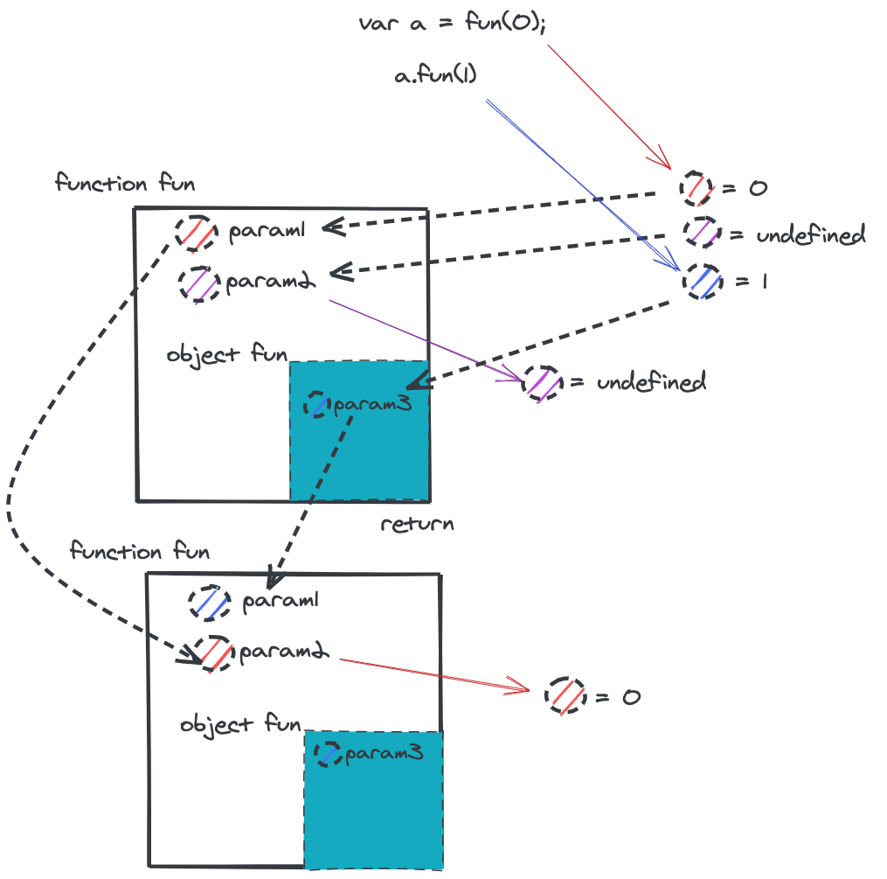
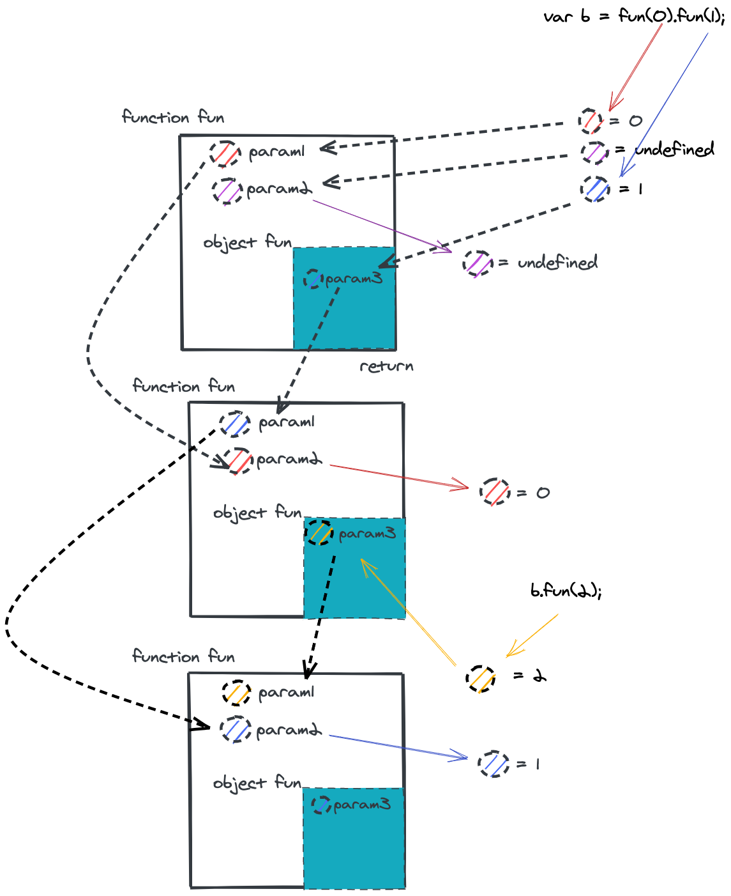

# JavaScript 中的闭包

> 闭包是在函数里面定义一个函数，该函数可以是匿名函数，该子函数能够读写父函数的局部变量。

## 从一个 🌰 说起

```javascript
function fun(param1, param2) {
  console.log(param2);

  return {
    fun: function(param3){
      return fun(param3, param1);
    }
  }
}

var a = fun(0); // undefined
a.fun(1); // 0
a.fun(2); // 0
a.fun(3); // 0

/**
 * undefined
 * 0
 */
var b = fun(0).fun(1);
b.fun(2); // 1
b.fun(3); // 1

/**
 * undefined
 * 0
 * 1
 * 2
 */
var c = fun(0).fun(1).fun(2).fun(3);
```

### 图解 **a** 的执行



### 图解 **b** 的执行



> c 和接下来的执行以此类推

### 小结

> 根据上面的代码我们不难发现 **function fun** 中的参数在局部作用域中形成了作用域链

- 闭包的本质就是在函数内部定义一个子级作用域函数。
- 闭包在使用的时候不会释放外部的引用，闭包函数内部的值会在当前的局部作用域中常驻。
- 闭包里面的匿名函数，读取变量的顺序，先读取当前作用域中的局部变量，再读取父级作用域的局部变量。


## 闭包的应用

### 中间件

> Express 中的 🌰 

```javascript
var middleware = function (s) {
  return function (req, res, next) {
    console.log(s);  // hello world
    return next();
  }
}

app.use(middleware('hello world'));
```

### 私有属性封装

```javascript
var person = function(){    
  var name = "default"; // 变量作用域为函数内部，外部无法访问        
      
  return {    
    getName : function(){    
      return name;    
    },    
    setName : function(newName){    
      name = newName;    
    }    
  }    
}();    
     
console.log(person.name);      // undefined    
console.log(person.getName()); // default
person.setName("name");    
console.log(person.getName()); // name 
```

### 结果缓存

开发中会碰到很多情况，设想我们有一个处理过程很耗时的函数对象，每次调用都会花费很长时间，那么我们就需要将计算出来的值存储起来，当调用这个函数的时候，首先在缓存中查找，如果找不到，则进行计算，然后更新缓存并返回值，如果找到了，直接返回查找到的值即可。闭包正是可以做到这一点，因为它不会释放外部的引用，从而函数内部的值可以得以保留。

```javascript
var CacheService = (function() {
  var cache = {};  

  return {    
    add: function(key) {   
      if (key in cache) return cache[key]; // 直接返回缓存结果 
      cache[key] = doSomethings(); // 执行超级耗时的操作
      return result;          
    },    
  
    clear: function(key){    
      if (key in cache){    
        delete cache[key];     
      }    
    }    
  };    
})();    
     
CacheService.add("input");
CacheService.clear("input");
```

## 闭包与内存泄漏

> **javascript** 的主要垃圾回收算法是通过引用计数
> 
> 1. 假设有 a，b，c 三个对象，当 a 引用 b 的时候，b 的引用计算器增加 1
> 2. b 引用 c 的时候，c 引用计数器增加1，当 a 被释放的时候，b 的引用计数器减少 1，变成 0 的时候被释放，c 计数器变成 0，然后被释放
> 3. 但是当遇到 b 和 c 之间互相引用的时候，无法通过引用计数的方式释放内存。

```javascript
function a() {
  var localVal = 10;
  return function() {
    console.log(localVal);
    return localVal;
  }
}

var funcA = a();
funcA();  // 10
```

当 a 函数结束的时候，想要释放，发现它的 localVal 变量被匿名函数引用，a函数无法释放。

所以说，闭包并不是什么坏东西，不要每次提到闭包都与内存泄漏挂钩。正常使用闭包是在使用内存，而不是在内存泄漏，请充分利用好闭包的特性。
