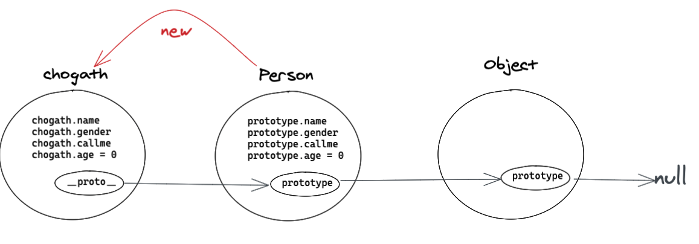

# JavaScript 中的面向对象

# JavaScript 中的原型与原型链

> `__proto__` 是任何对象都有的属性，在js中会形成一条 `__proto__` 连起来的链条，最终会被指向顶级 Object 对象，并且 Object.prototype 的值为 null。

- prototype：此属性只有构造函数才有，它指向的是当前构造函数的原型对象。
- __proto__：此属性是任何对象都会有的一个属性，它指向了产生当前对象的构造函数的原型对象。

```javascript
// 构造函数
function Person(name, gender) {
  this.name = name;
  this.gender = gender;
}

Person.prototype.age = 0;

Person.prototype.callme = function () {
  console.log(this.name + ' calling...');
}

// 对象实例化
var chogath = new Person('chogath', 'boy');
var lux = new Person('lux', 'girl');

console.log(chogath.name); // chogath
console.log(chogath.gender); // boy
chogath.callme(); // chogath calling...

lux.age = 16;
console.log(lux.age); // 16
console.log(Person.prototype.age) // 0
```

;
